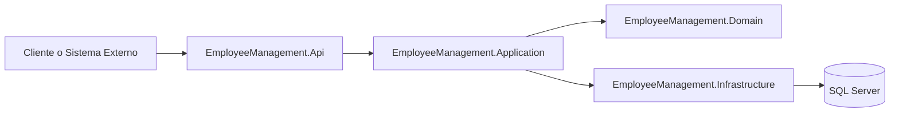

# Employee-Management-API

API RESTful para la gestión de empleados y departamentos, implementada en .NET 9 con separación por capas (Api, Application, Domain, Infrastructure) y orientada a escenarios de backoffice empresarial.

## 1) Problema que resuelve

Las organizaciones pequeñas y medianas suelen gestionar información de RRHH en hojas de cálculo o sistemas aislados, lo que genera:

- Inconsistencia de datos entre áreas.
- Dificultad para consultar estructuras organizacionales.
- Cálculos manuales de nómina por reglas de cargo.
- Ausencia de una API segura para integrarse con otros sistemas.

Esta API centraliza la gestión de empleados y departamentos con autenticación JWT, validación de entrada y operaciones CRUD listas para integrar con paneles, ERPs o herramientas internas.

## 2) Ámbitos de aplicación

- RRHH: alta/baja/actualización de empleados, asignación por departamento.
- Administración y finanzas: cálculo de salario total por área.
- TI y arquitectura empresarial: fuente única de datos organizacionales vía API.
- Integraciones internas: consumo desde portales web, intranet o servicios de terceros.

## 3) Casos de uso

- Crear un nuevo empleado y asignarlo a un departamento.
- Consultar el listado de empleados de un departamento específico.
- Obtener el salario total de un departamento para reportes.
- Actualizar datos de empleado (posición, salario base, email).
- Eliminar empleados o departamentos obsoletos.
- Consumir documentación OpenAPI para integración rápida.

## 4) Stack tecnológico

- .NET 9 / ASP.NET Core Web API
- Entity Framework Core 9 + SQL Server
- JWT Bearer Authentication
- FluentValidation
- Swagger/OpenAPI
- xUnit + Moq + FluentAssertions
- Docker y Docker Compose

## 5) Arquitectura del repositorio



### Capas

- Api: controladores, autenticación, configuración y exposición HTTP.
- Application: casos de uso, DTOs, validaciones y orquestación.
- Domain: entidades, reglas de negocio y contratos (interfaces).
- Infrastructure: EF Core, repositorios y Unit of Work.

## 6) Endpoints principales

### Auth

- `POST /api/auth/login`

### Employees

- `GET /api/employees`
- `GET /api/employees/{id}`
- `POST /api/employees`
- `PUT /api/employees/{id}`
- `DELETE /api/employees/{id}`

### Departments

- `GET /api/departments`
- `GET /api/departments/{id}`
- `GET /api/departments/{id}/employees`
- `GET /api/departments/{id}/total-salary`
- `POST /api/departments`
- `PUT /api/departments/{id}`
- `DELETE /api/departments/{id}`

## 7) Mejoras y optimizaciones aplicadas

En esta iteración se introdujeron mejoras funcionales y de eficiencia:

- Optimización de consultas de lectura en repositorios con `AsNoTracking()` para reducir overhead del change tracker en operaciones GET.
- Borrado asíncrono con soporte de `CancellationToken` en repositorios (evita operación síncrona bloqueante).
- Validación de integridad referencial en creación/actualización de empleados:
  - Se verifica existencia del departamento antes de persistir.
  - Se devuelve `400 BadRequest` con mensaje claro cuando no existe.
- Mejora semántica HTTP en endpoints de departamentos:
  - `GET /api/departments/{id}/employees` ahora devuelve `404` si el departamento no existe.
  - `GET /api/departments/{id}/total-salary` ahora devuelve `404` si el departamento no existe.
- Cobertura adicional de pruebas unitarias para los nuevos escenarios de validación.

## 8) Inicio rápido

### Prerrequisitos

- Docker + Docker Compose
- .NET SDK 9.0 (para ejecución local y pruebas)

### Ejecución con Docker

```bash
docker compose up -d --build
```

Servicios:

- API: http://localhost:8080
- Swagger: http://localhost:8080/swagger
- SQL Server: localhost:1433

### Ejecución local

```bash
dotnet restore
dotnet run --project src/EmployeeManagement.Api
```

### Comandos útiles (Makefile)

```bash
make up
make down
make test
make build
```

## 9) Autenticación

Credenciales de ejemplo actuales:

- username: `admin`
- password: `admin123`

Solicitud de login:

```bash
curl -X POST http://localhost:8080/api/auth/login \
  -H "Content-Type: application/json" \
  -d '{"username":"admin","password":"admin123"}'
```

Uso del token:

```text
Authorization: Bearer <TOKEN>
```

## 10) Variables de entorno

Ejemplo recomendado:

```bash
ASPNETCORE_ENVIRONMENT=Development
ConnectionStrings__Default=Server=<host>;Database=<db>;User Id=<user>;Password=<password>;TrustServerCertificate=True
Jwt__Key=<secure-key>
Jwt__Issuer=http://localhost:8080
Jwt__Audience=http://localhost:8080
SA_PASSWORD=<sql-sa-password>
```

## 11) Health checks

- `/health/live`
- `/health/ready`

## 12) Testing

```bash
dotnet test
dotnet test --collect:"XPlat Code Coverage"
```

## 13) Limitaciones actuales y siguientes mejoras sugeridas

- El login usa credenciales estáticas (no Identity/usuarios persistidos).
- No hay pipeline CI/CD incluido en el repositorio.
- No hay proyecto de pruebas de integración (solo unitarias).
- Falta versionado explícito de API (`/api/v1`).

Siguientes pasos recomendados:

- Integrar ASP.NET Core Identity + refresh tokens.
- Agregar pruebas de integración con Testcontainers.
- Incorporar pipeline CI (build + test + análisis).
- Implementar logging estructurado (por ejemplo, Serilog).

## Autor

Luis Raigoso (@LuisRai / lraigosov)

## Licencia

Consulta el archivo `LICENSE`.
