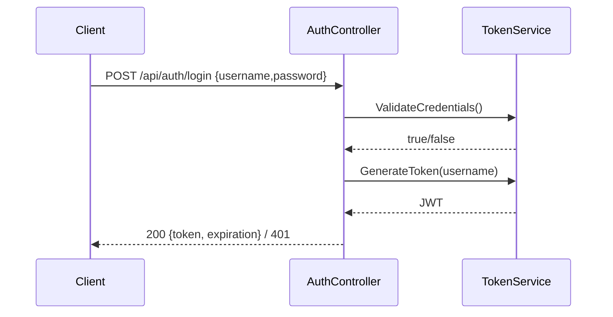

# Employee-Management-API

API RESTful para la gestión de empleados y departamentos, desarrollada con .NET 9 siguiendo principios de Clean Architecture.

## Tecnologías Utilizadas

- **.NET 9.0**: Framework principal
- **ASP.NET Core**: Web API
- **Entity Framework Core 9**: ORM con SQL Server
- **JWT Bearer Authentication**: Seguridad
- **FluentValidation**: Validaciones
- **Swagger/OpenAPI**: Documentación de API
- **xUnit, Moq, FluentAssertions**: Testing
- **Docker & Docker Compose**: Contenedorización

## Arquitectura

Diagrama de alto nivel basado en el código actual:

```mermaid
flowchart LR
  Client[Cliente] --> API[EmployeeManagement.Api\nControllers: Auth, Employees, Departments]
  API --> App[EmployeeManagement.Application\nServices, DTOs, Validators]
  App --> Domain[EmployeeManagement.Domain\nEntities, Enums, Interfaces]
  App --> Infra[EmployeeManagement.Infrastructure\nRepositories, UnitOfWork]
  Infra --> Db[(SQL Server)\nApplicationDbContext]
```

## Endpoints Principales

### Autenticación
- `POST /api/auth/login` - Autenticación con JWT

### Employees
- `GET /api/employees` - Listar todos los empleados
- `GET /api/employees/{id}` - Obtener empleado por ID
- `POST /api/employees` - Crear empleado
- `PUT /api/employees/{id}` - Actualizar empleado
- `DELETE /api/employees/{id}` - Eliminar empleado

### Departments
- `GET /api/departments` - Listar todos los departamentos
- `GET /api/departments/{id}` - Obtener departamento por ID
- `GET /api/departments/{id}/employees` - Empleados de un departamento
- `GET /api/departments/{id}/total-salary` - Salario total del departamento
- `POST /api/departments` - Crear departamento
- `PUT /api/departments/{id}` - Actualizar departamento
- `DELETE /api/departments/{id}` - Eliminar departamento

## Inicio Rápido

### Prerrequisitos
- Docker y Docker Compose
- .NET SDK 9.0 (opcional, para desarrollo local)

### Ejecución con Docker

```bash
# Iniciar todos los servicios
docker compose up -d

# API: http://localhost:8080
# SQL Server: localhost:1433
```

### Ejecución Local

```bash
# Restaurar dependencias
dotnet restore

# Ejecutar la API
dotnet run --project src/EmployeeManagement.Api
```

Nota: el arranque en Development ejecuta `Database.Migrate()`. El repositorio no incluye migraciones; si se requieren, créalas con `dotnet ef migrations add <Nombre>` en la capa `Infrastructure` antes de usar `database update`.

## Autenticación

Para obtener un token JWT:

```bash
curl -X POST http://localhost:8080/api/auth/login \
  -H "Content-Type: application/json" \
  -d '{
    "username": "admin",
    "password": "admin123"
  }'
```

Luego úsalo en los headers:

```
Authorization: Bearer <TOKEN>
```

Diagrama de flujo (login):



## Swagger UI

Documentación interactiva:
- Desarrollo: http://localhost:8080/swagger

## Testing

```bash
# Ejecutar todos los tests
dotnet test

# Cobertura
dotnet test --collect:"XPlat Code Coverage"
```

## Variables de Entorno

Usa variables (dummies en documentación):

```bash
ASPNETCORE_ENVIRONMENT=Development
ConnectionStrings__Default=Server=<host>;Database=<db>;User Id=<user>;Password=<password>;TrustServerCertificate=True
Jwt__Key=CHANGE_ME
Jwt__Issuer=http://localhost:8080
Jwt__Audience=http://localhost:8080
```

Validación de secretos (estado actual del repo):
- `src/EmployeeManagement.Api/appsettings.json`: contiene cadena de conexión y clave JWT (versionado)
- `docker-compose.yml`: define `SA_PASSWORD` y `Jwt__Key` (versionado)
- `.env`: ignorado por Git (preferible ubicar secretos aquí)

Recomendación: mover valores sensibles a `.env` y configurar por entorno; no incluir secretos en archivos versionados.

## Health Checks

- `/health/live`: liveness
- `/health/ready`: readiness (verifica BD)

## Modelo de Dominio

### Employee
- Cálculo de salario según posición
- Developer: +10%
- Manager: +20%
- HR/Sales: base

### Department
- Relación 1:N con Employees
- Cálculo de salario total del departamento

## CI/CD

No hay pipeline CI/CD incluido en este repositorio.

## Autor

**Luis Raigoso** (@LuisRai / lraigosov)

## Licencia

Consulta las condiciones en el archivo `LICENSE` incluido en el repositorio.
